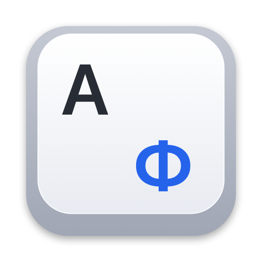
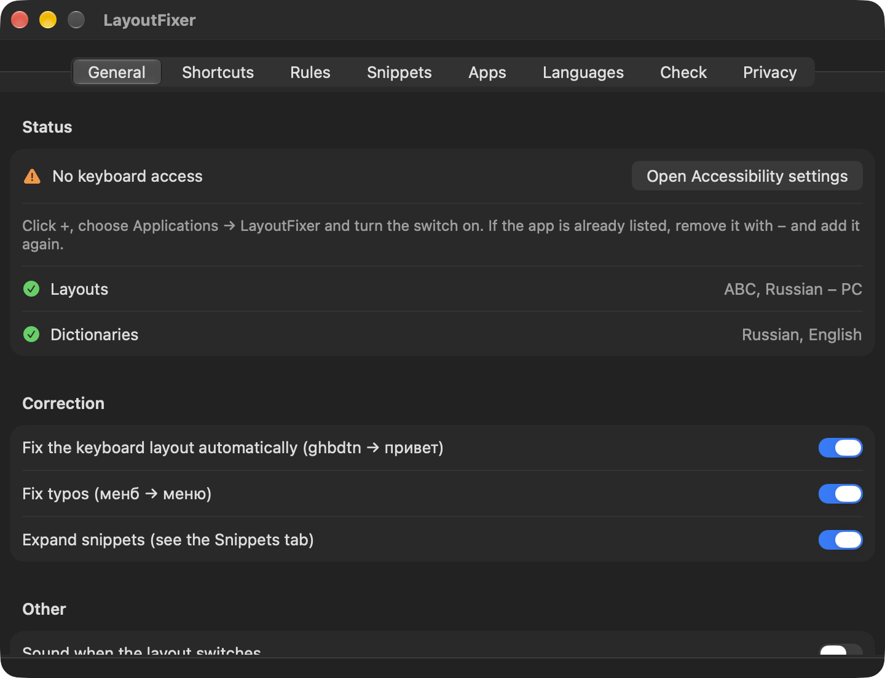
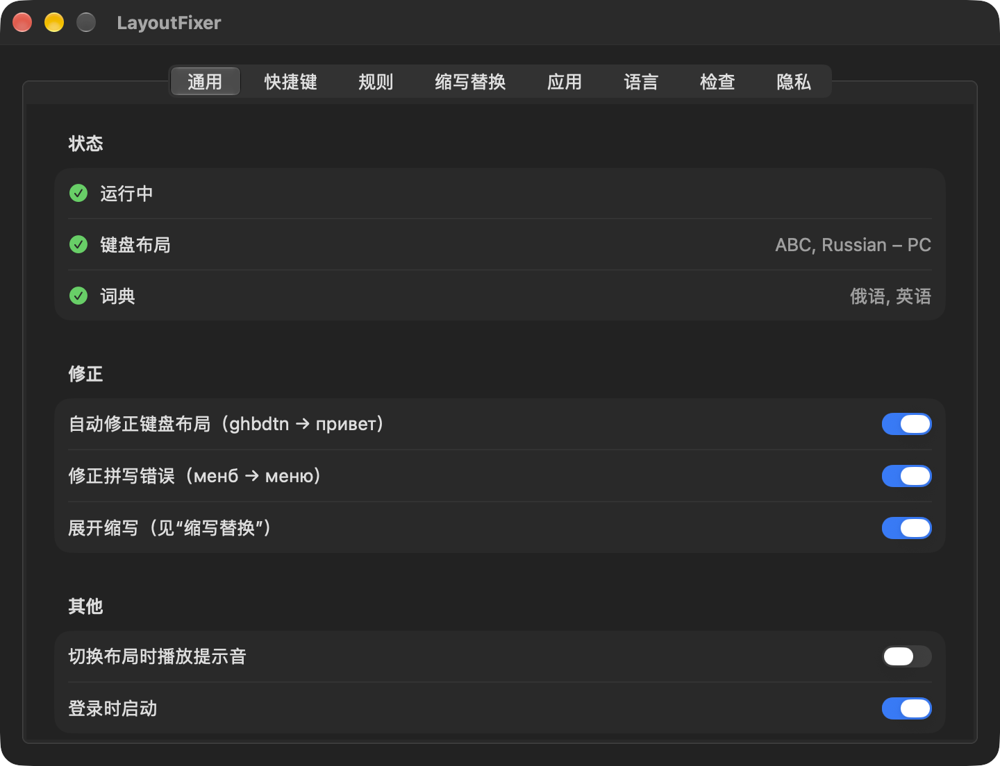
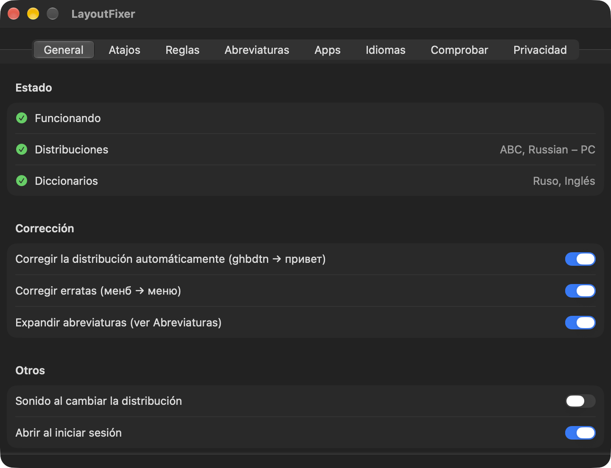
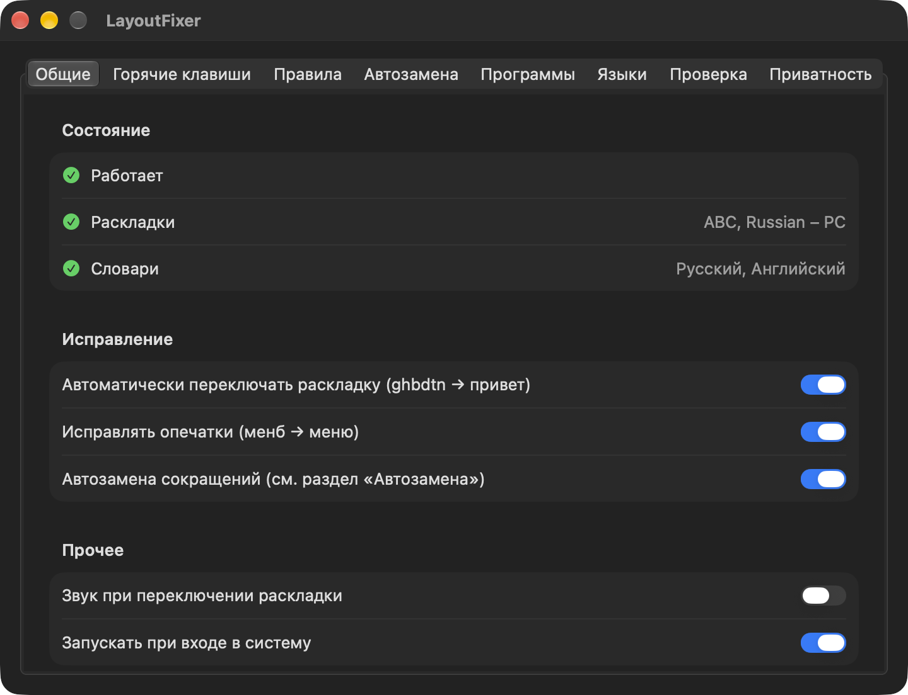

<p align="center">
  
</p>

<h1 align="center">LayoutFixer</h1>

<p align="center"><b>Type first, let the layout catch up.</b></p>

<p align="center">
  A free and open-source macOS menu bar app that turns <code>ghbdtn</code> into <code>привет</code>
  and <code>руддщ</code> into <code>hello</code> — and never keeps what you type.
</p>

<p align="center">
  <a href="https://github.com/galaxysochi-code/LayoutFixer/releases/latest"><b>Download for free</b></a> ·
  <a href="https://github.com/galaxysochi-code/LayoutFixer/releases/latest">Latest Release</a>
</p>

<p align="center">
  <a href="https://github.com/galaxysochi-code/LayoutFixer/actions/workflows/build.yml"></a>
  <a href="https://github.com/galaxysochi-code/LayoutFixer/releases/latest"></a>
  
  
  <a href="LICENSE"></a>
</p>

<p align="center">
  
</p>

LayoutFixer watches for words typed in the wrong keyboard layout and fixes them as you go,
using the spelling dictionaries already built into macOS. Everything happens locally: no
account, no analytics, no network requests — and, unlike similar tools, no log of what you type.

The interface speaks **English, Simplified Chinese, Spanish and Russian**, and the spell checking
can use any dictionary installed in macOS — about forty of them, from British English to German.

<p align="center">
  <b>English</b> · <a href="#简体中文">简体中文</a> · <a href="#español">Español</a> · <a href="#русский">Русский</a>
</p>

## Features

- **Fixes the layout automatically.** After a space or punctuation mark, a word that means nothing
  in the current layout but is a real word in the other one gets replaced: `yblthkfyls` → `Нидерланды`.
- **Fixes typos** using the macOS dictionaries: `менб` → `меню`, `recieve` → `receive`. Among the
  system's suggestions it picks the one closest on the keyboard, so `менб` becomes `меню`, not `меня`.
- **Forced conversion** of the last word by shortcut, even for slang and names no dictionary knows.
- **Selection actions:** switch layout, invert case (`пРИВЕТ` → `Привет`), transliterate (`привет` ↔ `privet`).
- **One-key undo.** The reverted word is remembered and left alone from then on.
- **Snippets:** type `спс` and get `Спасибо!`. Works in either layout.
- **Exceptions** by word and by app.
- **Your choice of dictionaries.** Russian and English (US) by default; any Latin dictionary
  installed in macOS can be added — British English, Spanish, German, French and the rest. Words
  count as correct if any enabled dictionary of their alphabet knows them.
- **Four interface languages:** English, Simplified Chinese, Spanish and Russian, picked
  automatically from the system language or chosen by hand.

## Requirements

- macOS 13 or later.
- Two keyboard layouts: one Latin, one Cyrillic.
- Accessibility permission — without it the app cannot see the keyboard.

## Installation

1. Download `LayoutFixer.dmg` from the
   [latest release](https://github.com/galaxysochi-code/LayoutFixer/releases/latest).
2. Open it and drag **LayoutFixer** to Applications.
3. The app isn't notarized by Apple, so macOS may block the first launch: open
   **System Settings → Privacy & Security** and click **Open Anyway**.
4. Open **System Settings → Privacy & Security → Accessibility**, add LayoutFixer with **+**
   and turn the switch on.
5. The menu bar shows an **A/Ф** keycap. A filled key means it's working; an outlined key means
   permission is missing.

The app is signed with an ad-hoc signature that changes on every build, so macOS asks for the
permission again after each update. Remove the old entry with **−** and add the app again.

## Privacy

This app was written for personal use, and the main requirement was that it must not collect
what you type.

- Keystrokes are never written to disk. Only the current word and the last word (for undo) live
  in memory, and they are cleared after every space, mouse click and app switch.
- There is no log or diary of typed text, and there never will be.
- No network code at all — zero requests.
- Password fields are skipped: macOS turns on secure input there, and the app also checks the
  field type and ignores password managers.
- Words with digits, `@`, dots or underscores are left alone, so logins stay as they are.
- The only things stored are the ones you see in the app: your exception words
  (`~/Library/Application Support/LayoutFixer/exceptions.txt`) and your snippets and settings
  (`~/Library/Preferences/local.layoutfixer.plist`).

See [PRIVACY.md](PRIVACY.md).

## Shortcuts

| Action | Default |
|---|---|
| Undo the replacement | ⌥+Space |
| Convert the current or last word (forced) | Right ⌥ |
| Convert the selection | Right ⌘ |
| Invert case of the selection | not set |
| Transliterate the selection | not set |

All of them can be changed in the app, including recording your own combination. macOS usually
keeps ⌘+Space and ⌃+Space for itself (Spotlight and input sources), so those never reach the app
until you free them in Keyboard settings.

## Build from source

```bash
git clone https://github.com/galaxysochi-code/LayoutFixer.git
cd LayoutFixer
./build.sh      # builds build/LayoutFixer.app
./make_dmg.sh   # builds build/LayoutFixer.dmg
```

Xcode Command Line Tools are the only requirement — no third-party libraries. The icon is drawn
during the build by `make_icon.swift`.

## How it works

- Keystrokes are intercepted with a `CGEventTap` running on its own thread. That thread never
  makes a call that waits for the system: any wait there would freeze input everywhere.
- The handler only records key codes. The decision is made afterwards on the main thread, and the
  replacement happens once the character has already been typed.
- Layouts are read through `UCKeyTranslate` from the system tables, so the app works with any
  variant of a layout, and it stays out of the way while an input method (such as Pinyin) is active.
- Words are checked with `NSSpellChecker` — the macOS dictionaries, locally.

## Limitations

- Latin ↔ Cyrillic only.
- Replacement depends on the macOS dictionaries: slang, names and rare words stay as they are —
  use the forced conversion shortcut for those.
- Words shorter than two letters are not replaced automatically.
- In some apps (usually Electron-based) the text insertion may not always land.

## Author

Vladislav Tolmachev

## License

[MIT](LICENSE). Not affiliated with Apple.

---

## 简体中文

**先打字，布局随后跟上。**

LayoutFixer 是一款免费开源的 macOS 菜单栏应用：它把用错键盘布局打出的 `ghbdtn` 变成 `привет`，
把 `руддщ` 变成 `hello`。判断依据是 macOS 自带的拼写词典，全部在本机完成：无需账户，没有数据分析，
不发送任何网络请求，也不记录你输入的内容。

[免费下载](https://github.com/galaxysochi-code/LayoutFixer/releases/latest)

<p align="center">
  
</p>

### 功能

- **自动修正布局：** 空格或标点之后，如果当前布局下的词毫无意义，而在另一种布局下是真实单词，就会被替换。
- **修正拼写错误：** `менб` → `меню`、`recieve` → `receive`。在系统给出的候选中，优先选择键盘上相邻的那个。
- **强制转换**最后一个词的布局，即使词典里没有这个词（俚语、人名）。
- **对选中文本的操作：** 切换布局、反转大小写、俄语与拉丁字母互转。
- **一键撤销**，被撤销的词会被记住，之后不再修改。
- **缩写替换：** 输入 `спс` 得到 `Спасибо!`。
- 按词和按应用设置例外。
- **自选词典：** 默认俄语和英语（美国），可添加 macOS 中已安装的任意拉丁语词典（英式英语、西班牙语、德语等）。
- **四种界面语言：** 英语、简体中文、西班牙语和俄语，默认跟随系统。

### 系统要求

- macOS 13 或更高版本。
- 两种键盘布局：一种拉丁字母，一种西里尔字母。
- 辅助功能权限，否则应用无法读取键盘。

### 安装

1. 从[最新版本](https://github.com/galaxysochi-code/LayoutFixer/releases/latest)下载 `LayoutFixer.dmg`。
2. 打开后把 **LayoutFixer** 拖到“应用程序”。
3. 该应用未经 Apple 公证，首次打开时 macOS 可能会阻止：打开**系统设置 → 隐私与安全性**，点按**“仍要打开”**。
4. 在**系统设置 → 隐私与安全性 → 辅助功能**中用 **+** 添加 LayoutFixer 并打开开关。
5. 菜单栏中会出现 **A/Ф** 键帽图标：实心表示正在工作，空心表示缺少权限。

### 隐私

按键不会写入磁盘：内存中只保留当前词和上一个词（用于撤销），并在每次空格、鼠标点按和切换应用后清除。
没有输入记录，也不会有。应用不含任何网络代码。密码输入框会被跳过，含数字、`@`、点号的词不会被修改。
详见 [PRIVACY.md](PRIVACY.md)。

### 关于中文

中文通过输入法（拼音）输入，而不是键盘布局，因此没有可替换的字母；macOS 也没有中文拼写词典。
输入法处于激活状态时，应用不会介入。

### 许可证

[MIT](LICENSE)。与 Apple 无关。

---

## Español

**Escribe primero; la distribución se corrige sola.**

LayoutFixer es una app gratuita y de código abierto para la barra de menús de macOS: convierte
`ghbdtn` en `привет` y `руддщ` en `hello`, usando los diccionarios ortográficos que ya trae macOS.
Todo ocurre en tu Mac: sin cuenta, sin analíticas, sin conexiones de red y sin registrar lo que escribes.

[Descargar gratis](https://github.com/galaxysochi-code/LayoutFixer/releases/latest)

<p align="center">
  
</p>

### Funciones

- **Corrige la distribución automáticamente:** tras un espacio o un signo de puntuación, la palabra
  que no significa nada en la distribución actual y sí en la otra se reemplaza.
- **Corrige erratas** con los diccionarios de macOS: `menb` → `menú`, `recieve` → `receive`. Entre las
  sugerencias del sistema elige la más cercana en el teclado.
- **Conversión forzada** de la última palabra con un atajo, aunque no esté en ningún diccionario.
- **Acciones sobre la selección:** cambiar la distribución, invertir mayúsculas y minúsculas, transliterar.
- **Deshacer con una tecla.** La palabra revertida queda en la lista de excepciones.
- **Abreviaturas:** escribe `spc` y obtén el texto completo. Funciona en cualquier distribución.
- Excepciones por palabra y por aplicación.
- **Diccionarios a tu elección:** ruso e inglés (EE. UU.) por omisión; puedes añadir español,
  inglés británico, alemán y cualquier otro instalado en macOS.
- **Cuatro idiomas de interfaz:** inglés, chino simplificado, español y ruso, según el idioma del sistema.

### Requisitos

- macOS 13 o posterior.
- Dos distribuciones de teclado: una latina y una cirílica.
- Permiso de Accesibilidad; sin él la app no puede leer el teclado.

### Instalación

1. Descarga `LayoutFixer.dmg` desde la
   [última versión](https://github.com/galaxysochi-code/LayoutFixer/releases/latest).
2. Ábrelo y arrastra **LayoutFixer** a Aplicaciones.
3. Apple no ha notarizado la app, así que macOS puede bloquear la primera apertura: abre
   **Ajustes del Sistema → Privacidad y seguridad** y haz clic en **Abrir igualmente**.
4. En **Ajustes del Sistema → Privacidad y seguridad → Accesibilidad**, añade LayoutFixer con **+**
   y activa el interruptor.
5. En la barra de menús aparece una tecla **A/Ф**: rellena significa que funciona; con solo el
   contorno, falta el permiso.

### Privacidad

Las pulsaciones nunca se guardan en disco: en memoria solo viven la palabra actual y la anterior
(para deshacer), y se borran con cada espacio, clic y cambio de app. No hay registro de lo escrito
ni lo habrá. La app no tiene código de red. Los campos de contraseña se omiten, igual que las
palabras con cifras, `@` o puntos. Consulta [PRIVACY.md](PRIVACY.md).

### Licencia

[MIT](LICENSE). Sin relación con Apple.

---

## Русский

**Печатайте как есть — раскладка догонит.**

LayoutFixer — бесплатное приложение для строки меню macOS с открытым кодом: превращает `ghbdtn`
в `привет`, а `руддщ` в `hello`. Решение принимается по словарям, встроенным в macOS. Всё работает
локально: без аккаунта, аналитики и сетевых запросов — и, в отличие от похожих программ, без
журнала набранного текста.

[Скачать бесплатно](https://github.com/galaxysochi-code/LayoutFixer/releases/latest)

<p align="center">
  
</p>

### Возможности

- **Автопереключение раскладки.** После пробела или знака препинания слово, которое ничего не значит
  в текущей раскладке, но является словом в другой, заменяется: `yblthkfyls` → `Нидерланды`.
- **Исправление опечаток:** `менб` → `меню`, `првиет` → `привет`. Из вариантов macOS выбирается
  ближайший по клавиатуре, поэтому `менб` становится `меню`, а не `меня`.
- **Принудительный перевод** последнего слова по горячей клавише — даже если слова нет в словаре.
- **Действия с выделенным текстом:** сменить раскладку, сменить регистр (`пРИВЕТ` → `Привет`),
  транслитерация (`привет` ↔ `privet`).
- **Отмена замены** одной клавишей: отменённое слово попадает в исключения.
- **Автозамена сокращений:** `спс` → `Спасибо!`. Работает в любой раскладке.
- **Исключения** по словам и по программам.
- **Выбор словарей:** по умолчанию русский и английский (США), можно добавить любой латинский
  словарь, установленный в macOS: британский английский, испанский, немецкий и другие.
- **Четыре языка интерфейса:** английский, китайский, испанский и русский — берётся из языка системы
  или выбирается вручную.

### Требования

- macOS 13 или новее.
- Две раскладки: латинская и кириллическая.
- Доступ в «Универсальном доступе» — без него программа не видит клавиатуру.

### Установка

1. Скачайте `LayoutFixer.dmg` из
   [последнего релиза](https://github.com/galaxysochi-code/LayoutFixer/releases/latest).
2. Откройте и перетащите **LayoutFixer** в «Программы».
3. Программа не заверена Apple, поэтому первый запуск macOS может заблокировать: откройте
   **«Системные настройки» → «Конфиденциальность и безопасность»** и нажмите **«Открыть всё равно»**.
4. В разделе **«Универсальный доступ»** добавьте LayoutFixer кнопкой **«+»** и включите переключатель.
5. В строке меню появится клавиша **A/Ф**: залитая — работает, контур — нет доступа.

Подпись программы временная и меняется при каждой сборке, поэтому после обновления macOS просит
выдать доступ заново: удалите старую запись кнопкой «−» и добавьте программу снова.

### Приватность

Нажатия клавиш не пишутся на диск: в памяти живёт только текущее слово и предыдущее (для отмены),
и очищается после каждого пробела, клика мышью и смены программы. Журнала набранного текста нет и
не будет. Сетевого кода в программе нет совсем. Поля паролей пропускаются, слова с цифрами, `@` и
точками не трогаются. Подробности — в [PRIVACY.md](PRIVACY.md).

### Горячие клавиши

| Действие | По умолчанию |
|---|---|
| Отменить замену | ⌥+Пробел |
| Сменить раскладку слова (принудительно) | правый ⌥ |
| Сменить раскладку выделенного | правый ⌘ |
| Сменить регистр выделенного | не задано |
| Транслитерация выделенного | не задано |

### Лицензия

[MIT](LICENSE). Не связано с Apple.
